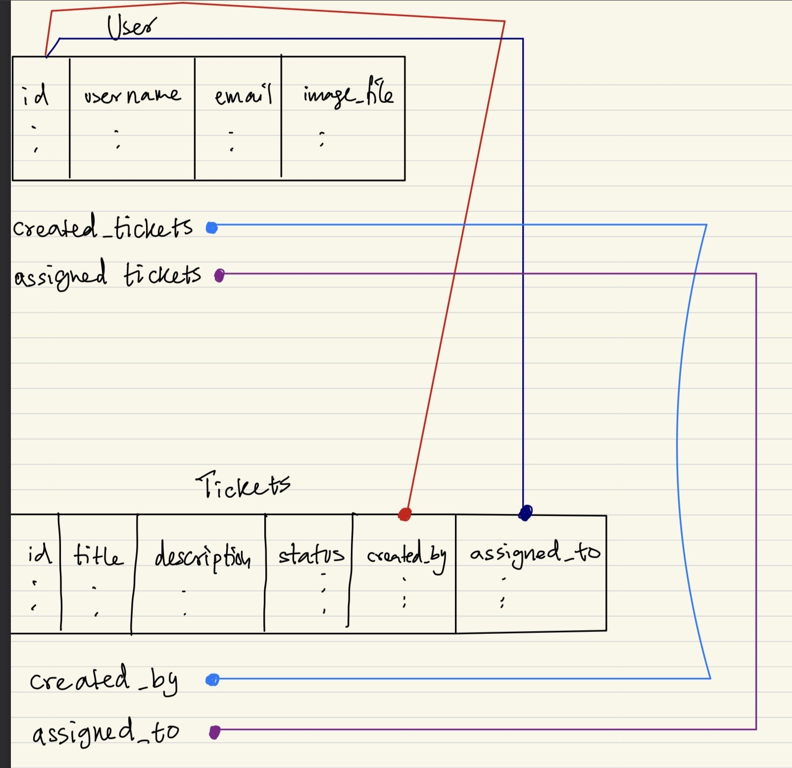

<!--  -->


1) A user can create an own many tickets, so we know our attribute Tickets can be a list of Tickets. But a Ticket can have only 1 creater so its type of just User. Now since we are using Python, if Hassan.created_tickets has a ticket with id 2, then Ticket_id_2_object.author MUST EQUAL Hassan. I Think back_populates keyword is what connects this relationship and also allows SQLAlchemy to create/update this relationship when a new item is added

2) The foreign keys seem kind of over the place so I will work with an assumption. I am assuming Hassan.created_tickets is a list of Tickets but so is Hassan.assigned tickets so we have to make sure the tickets that are in hassan.created_tickets must be in the Ticket.created_by_id column.


Later on I can add a comments class or something like:

```Python
class Comment(Base):
    __tablename__ = "comments"

    id: Mapped[int]
    content: Mapped[str]

    ticket_id: Mapped[int] = mapped_column(
        ForeignKey("tickets.id")
    )

    author_id: Mapped[int] = mapped_column(
        ForeignKey("users.id")
    )
```

and since I would like relationships for that too I can use the same formula and make it

```python
# for comments
author: Mapped[User] = relationship(
    back_populates="written_comments",
    foreign_keys=[author_id]
)
ticket: Mapped[Ticket] = relationship(
    back_populates="ticket_comments",
    foreign_keys=[ticket_id]
)
# for user
written_comments: Mapped[list["Comment"]] = relationship(
    back_populates="author"
)

# for tickets
ticket_comments: Mapped[list["Comment"]] = relationship(
    back_populates="ticket"
)
```